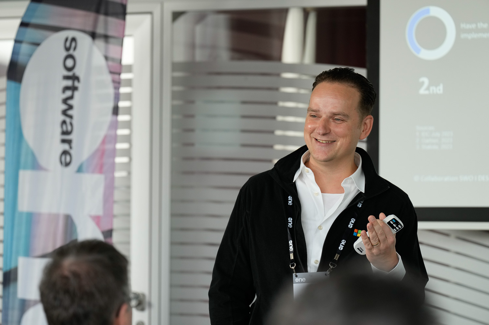

---
hide:
  - navigation
  - toc
---

Kay Schneutzer

Data & AI &middot; Business Development &middot; Cloud Technologies

The path to success is not reflected in a job vita you can read on [LinkedIn](https://www.linkedin.com/in/kay-schneutzer-50169817/). It's the things you won't find there. I feel home in Hamburg and Goa. I work with topics I love — AI, Microsoft Technology, Business Development, and Entrepreneurship in an international environment.

## What I believe in

Always do what I believe in.

Today is always the perfect day to start something new.

Be the trusted person I want to rely on.

Whenever I am scared to do something, ensure that I am doing it.

## Experience

### Presales Consultant Data & AI

Jul 2024 — Present &middot; SoftwareOne, Germany (Hybrid)

- Utilizing data-driven analytics for strategic decision-making and fostering innovation
- Collaborating with clients on strategic objectives through public speaking and advisory
- Expanding expertise across Microsoft, Google Cloud, and AWS hyperscaler ecosystems

### Business Development Executive

Aug 2023 — Oct 2024 &middot; SoftwareOne, Hamburg

- Driving business development at a leading global platform, solutions, and services provider
- Supporting clients throughout their technology roadmap in digital transformation, software, and cloud computing

### Business Development for Microsoft Technologies & AI

Oct 2019 — Jul 2023 &middot; NTT Germany AG Co. KG, Hamburg

- Mentoring the European development program, helping talented people pitch their ideas
- Finalist at 2 global hackathons within NTT
- Reaching a Microsoft target with my manager, although the target was never set
- Presenting Conversational AI with a partner to Microsoft Global without preparation — and doing very well
- Explaining conversational AI to anyone at any time with colleague [Holger](https://github.com/holgerimbery) without any prior preparation
- Finally learning to kitesurf

### Business Development Manager for Microsoft & Workplace

May 2019 — Sep 2019 &middot; Dimension Data Germany AG Co. KG, Hamburg

- Setting up the Microsoft Business in Dimension Data Germany
- Being told by a colleague he will work with Microsoft Technology because of me
- Winning an Innovation Award for Conversational AI, which today is part of my job description
- Learning the value of a very good business plan

### Solution Architect for Microsoft Technologies

Jun 2014 — May 2019 &middot; Dimension Data Germany AG Co. KG, Hamburg

- Found new friends for life during the Dimension Data Fast Track Program in South Africa
- Giving a very personal presentation with my team during Fast Track Program
- Conducting a West Coast Swing Festival in India — [Namaste Swing](https://namasteswing.in/)

### Microsoft IT Cloud Consultant

Apr 2011 — May 2014 &middot; QSC AG / Info AG, Hamburg

- Leading part of a team building a private Microsoft Cloud
- Learning how cloud projects can fail
- One of the early cloud consultants who still looked up the definition of Cloud

### Account Manager BPOS

Jan 2010 — May 2011 &middot; Tulip Telecom, Mumbai

- Surviving India as a German sales person and truly reaching my personal limits
- Meeting my future wife
- Co-founding Mumbai's biggest Ballroom Dance school — [TanzVerden](https://www.facebook.com/TanzVerdenBallroomInternational)
- Teaching dancesport in India, watching my dance couple become Indian champions after one year
- Living on 80 m² with 8 people from 7 countries for 1 year on an Indian salary

### AIESEC President External Relations

Jan 2009 — May 2013 &middot; AIESEC, Halle/Saale

- Working long and motivated hours in a team without pay and being happy about it
- Creating my first sales engagement model in international teams, seeing it applied in a large organization
- Deciding to stop my 20-year dance career at the highest performance I ever achieved

## Education

### Martin Luther University of Halle-Wittenberg

- Professional Ballroom dancer and teacher
- Co-founded dance school [1STEP](https://ballroomlounge.wordpress.com/) in Halle/Saale — still going strong today
- Studying for one year in Bratislava, Slovakia
- Finishing some courses is sometimes more important than being good at it

### Elisabeth-Gymnasium Halle

- Started dancing at the age of eight
- Focusing early on what I loved and becoming really good at it — still helping me today

## Skills

It's expected that I have the skills to function at my current job. Here are some I train every day:

Body Language
Storytelling
Public Speaking
Presentation Skills
Team Building
Strategic Planning
Coaching
Mentoring
Negotiation
Persuasion
Conflict Resolution
Decision Making
Crisis Management
Empathy
Resilience
Adaptability
Innovation
Problem Solving
Critical Thinking
Intercultural Competence
Entrepreneurial Thinking
Personal Branding
Managing Remote Teams
Technology Trend Awareness
Self Leadership
Work-Life Balance

